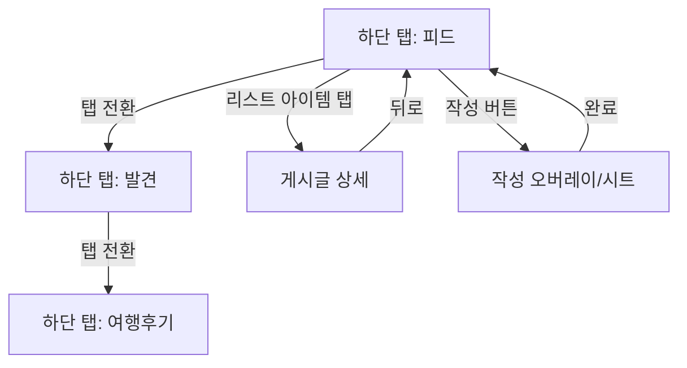
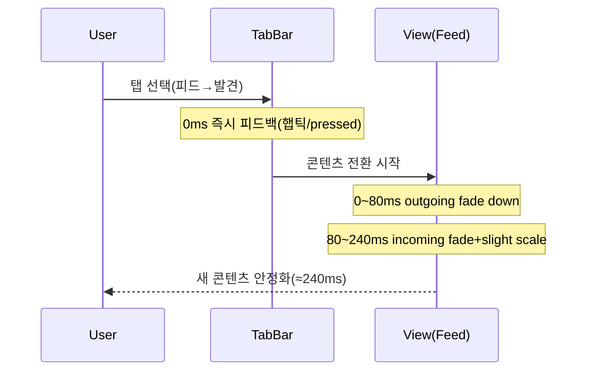

# 토스 증권 UI/UX 기반 게시판 탭 프런트엔드 제안서

## Executive summary

본 제안서는 **토스 앱(특히 증권 영역)의 화면 전환·하단 탭 애니메이션·피드(게시판) UI/UX를 “동일하거나 유사하게”** 구현하려는 목표를, **현재 GitHub 저장소 `pyrimidine02/girlsbandtabi_app`의 코드 베이스(Flutter + go_router + Riverpod) 위에서 실현**하기 위한 설계·모션·구현 방안을 통합적으로 제시한다.

핵심 결론은 다음과 같다.

첫째, 현재 저장소는 이미 **(1) 탭 상태 유지형 라우팅(StatefulShellRoute.indexedStack), (2) Material 계열 전환(fadeThrough/sharedAxisY), (3) 커스텀 하단 네비(블러/라운드/AnimatedSwitcher), (4) 게시판 탭(커뮤니티/여행후기)과 피드 카드/필터/검색**까지 갖춘 상태이므로, “토스 유사” 구현의 비용은 **완전 신규 개발이 아니라 ‘정렬(alignment)·토큰화(tokenization)·전환 규격화(specification)·컴포넌트 리팩터링’ 중심**으로 내려갈 수 있다.

둘째, “토스처럼 보이게”에서 가장 중요한 것은 **픽셀 단위 복제보다 ‘정보 구조(Information Architecture) + 모션 문법(Motion Grammar) + 상태 전환 규칙’의 복제**다. 특히 토스는 애니메이션을 (a) 이해를 돕는 신호, (b) 대기시간/결과 피드백, (c) 감정적 톤 조절 장치로 적극 활용한다는 점이 공개 사례에서 확인된다. citeturn11view1turn11view2turn11view3  
다만, 토스의 디자인 시스템/컴포넌트는 **지식재산권 및 사용 범위 제한(파트너 한정)**이 명시되어 있으므로, 외부 앱에서 **자산·컴포넌트·표현을 ‘그대로’ 복제하는 접근은 법적/윤리적 리스크가 존재**한다. 따라서 “유사 구현”은 **원리(패턴)·타이밍·곡선·상태 규칙을 참고하되, 토큰/아이콘/자산/미세 스타일은 독자화**하는 전략이 안전하다. citeturn7view0

셋째, 구현은 **Flutter 유지(현 코드 베이스의 연속성 + Impeller 기본화로 렌더링 예측 가능성 + 모션 구현 자유도)**가 최적이며, 탭/피드 전환은 **Material Motion(Shared axis/Fade through) 계열을 ‘토스식’으로 튜닝**하되, 하단 네비/상단 필터/피드 카드의 마이크로인터랙션을 **짧은 지속시간(≈150–220ms) + 강한 이징(easeOut 계열) + 최소 변형(Transform/Opacity 중심)**으로 규격화하는 것을 권장한다. Material의 기간/이징 가이드(모바일 전환 300ms 중심, enter≈225ms/exit≈195ms, 400ms 초과 지양)는 기준선으로 유효하다. citeturn9search2

---

## GitHub 저장소 코드 검토 결과

### 현행 기술 스택·구조 요약

저장소 `pyrimidine02/girlsbandtabi_app`는 **Flutter** 기반의 모바일 앱이며, 다음의 아키텍처 특징이 “토스 유사 UX” 구현에 직접적으로 유리하다.

라우팅은 `go_router`의 **StatefulShellRoute.indexedStack**로 구성되어, 하단 탭 간 이동 시 각 탭의 내비게이션 스택/스크롤 상태를 유지하는 “토스류 앱”의 체감에 가깝다(탭별 독립 Navigator). 이는 go_router 문서가 설명하는 “stateful nested navigation” 패턴과 동일한 축이다. citeturn19search0

전환(transition)은 `GBTPageTransitions`로 추상화되어 있으며,
- 동등 레벨(피어) 화면 전환: **fadeThrough()**
- 계층적/오버레이 성격: **sharedAxisY()**
로 분리되어 있다. 이는 “전환 유형을 의미에 따라 고정”하려는 목적(인지적 일관성)에 부합한다.

모션 토큰은 `GBTAnimations`에 **Duration/Curve 상수**로 이미 정리되어 있어(fast=130ms, normal=280ms, slow=420ms, emphasis=500ms / 기본 curve=easeOutCubic), “토스식 모션 가이드”를 **토큰 수준으로 재정의**하는 리팩터링이 쉽다.

### 하단 네비게이션(현행) 분석

커스텀 하단 네비 `GBTBottomNav`는 다음 특성을 가진다.

- **BackdropFilter(σ≈28) + 반투명 표면 + 상단 라운드(40dp)**로 “리퀴드 글라스” 스타일을 구현.
- 탭 아이템은 `AnimatedSwitcher(180ms)`로 아이콘을 교체하고, 선택 시 아이콘 크기(24↔22), 폰트 굵기(w700↔w500), 색상을 바꾼다.
- 탭 터치 시 `HapticFeedback.selectionClick()`을 호출하고,
- 접근성은 `Semantics(selected, button, label, hint)`로 기본 제공.

이 구성은 “세련된 커스텀 네비”로는 매우 좋지만, **토스(증권) 쪽의 전반적인 ‘절제된 정보 중심’ 톤**과 비교하면 “표면 효과(blur)·조형(큰 라운드)·강한 글라스 질감”이 과할 수 있다. 따라서 목표가 “토스 유사”라면, 하단 네비는 **(a) blur 강도/불투명도 절제, (b) 선택 상태를 더 ‘정보형’(라벨/아이콘 톤 변화)으로, (c) 애니메이션을 낮은 진폭의 transform/opacity 중심으로** 조정하는 쪽이 정렬된다.

### 게시판(피드) 영역(현행) 분석

`BoardPage`는 이미 “SNS 스타일”의 구조적 요소를 갖춘다.

- 상단: `AppBar`에 “게시판” 타이틀 + 구분선 + `ProjectSelectorCompact`(프로젝트 선택 UI)
- 상단 탭: `GBTSegmentedTabBar`로 **커뮤니티 / 여행후기** 분리
- 커뮤니티 탭:
  - 검색바(GBtSearchBar)
  - 모드 필터 칩: 최신/트렌딩/팔로잉(활성 칩 우선 정렬)
  - 팔로잉 모드일 때 구독 프로젝트 리스트 행
  - 최신 모드에서 좋아요≥5인 글로 “지금 인기 있어요” 캐러셀
  - 리스트: `RefreshIndicator` + infinite scroll(loadMore)
  - 카드: 작성자/시간/인기 배지 + 본문 스니펫 + 16:9 이미지 + 액션바(댓글/좋아요/공유)
- 여행후기 탭:
  - 카드형 리스트(커버 이미지 + 경로뱃지 + 인게이지먼트)

즉 “토스 증권 커뮤니티(피드형) + 탭 전환”에 필요한 대부분의 기초 부품은 이미 존재한다. 제안서의 핵심은 이를 **(1) 정보 구조를 사용자의 요구(추천/팔로잉/프로젝트별)로 재배열, (2) 문구/메타데이터 표기를 목표에 맞게 교정, (3) 모션을 ‘토스 체감’으로 리타겟**하는 것이다.

---

## 토스 증권 및 토스 내 네비게이션 모션 분석

### “토스다운 모션”의 공개 근거와 해석

공개된 사례(특히 모션/그래픽 관점)에서 토스는 애니메이션을 단순 장식이 아니라 **정보 전달력·대기 경험·감정 톤 조절**의 기능 요소로 본다. 예를 들어, 그래픽/애니메이션을 통해 “글을 읽지 않아도 이해”시키고, 로딩/완료 상태를 직관적으로 만들며, 축하(Confetti) 등 감정적 순간을 강화한다고 설명한다. citeturn11view1turn11view2turn11view3  
→ 따라서 “토스 유사 UX”를 목표로 할 때 핵심은 **상태 전환의 의미가 애니메이션으로 읽히도록** 만드는 것이다(예: 탭 전환=동등 레벨 이동, 상세 진입=부모→자식, 작성/신고=오버레이 등).

또한 토스는 온라인 컨퍼런스 콘텐츠에서도 “인터랙션 디자인(이미지·자막·영상 삽입/전환)”을 강조하며, 단순히 정보 전달이 아니라 **동적 흐름 설계 자체를 디자인의 핵심 산출물**로 다루고 있음을 시사한다. citeturn12search1  
그리고 TMC 세션 목록에서 **토스증권 UX/인터랙션**을 별도 트랙으로 다루는 것도(“토스증권 UX의 미래”, “인터랙션, 토스에선 어떻게 개발하나요?”) 조직적으로 모션/인터랙션을 중요한 역량으로 본다는 간접 증거다. citeturn13view0

### 공식 문서에서 확인되는 내비게이션 바/아이콘 원칙

토스 “앱인토스 개발자센터”(토스 생태계 내 미니앱 가이드)에서는 상단 내비게이션이 **모노톤 아이콘 중심**이어야 하며, 컬러 아이콘은 주의 분산/불필요 강조를 유발한다고 명시한다. citeturn7view1  
→ 이는 토스의 “정보형 UI” 톤과 맞닿아 있으며, 게시판 탭에서도 상단/하단 네비 아이콘은 **색상보다 형태(선/채움)·굵기·미세 스케일 변화로 상태를 표현**하는 쪽이 정렬된다.

또한, 토스의 TDS 관련 문서는 제공 자료가 토스에 귀속되고 제한적 사용 권한임을 명시한다. citeturn7view0  
→ 제안서에서는 “동일” 복제보다 **‘유사’(패턴/원리) 기반 재설계**를 권장한다.

### “토스식 타이밍/동기화”의 실무적 힌트

실무자들이 토스를 참고 구현할 때 흔히 쓰는 방법으로 **개발자 옵션의 Animator duration scale을 낮추거나 높여 느리게 보며 분석**한다는 사례가 공유되어 있다. citeturn17view0  
특히 “키보드가 올라오고 내려가는 애니메이션과 하단 버튼 애니메이션이 동일한 duration으로 맞물린다”는 관찰은, 토스가 **OS 레벨 애니메이션(키보드/인셋)과 앱 UI 애니메이션을 동기화**하는 품질 기준을 가진다는 점을 시사한다. citeturn17view0  
→ 게시판 탭에서도 (예: 검색바 포커스/키보드 등장/하단 네비 노출 상태) 같은 “인셋 변화”에 대해 애니메이션 동기화를 고려해야 한다.

### 전환 유형을 “의미 기반”으로 고정하는 근거

Material Motion/Android Material Transitions는 **Shared axis(X/Y/Z), Fade through, Container transform 등 전환 패턴을 ‘상황에 맞게’ 사용**하도록 정의한다. 예컨대 Shared axis는 동일 축을 공유하는 화면들의 관계를 전달하며, X/Y/Z축 별로 의미가 달라진다. citeturn8search7  
또한 Material 가이드는 모바일 전환에서 **300ms 전후**가 일반적이며, enter/exit 지속시간이 다를 수 있고 400ms를 넘으면 느리게 느껴질 수 있다고 제시한다. citeturn9search2  
→ 토스식 “빠르고 직관적” 전환을 만들려면, **지속시간을 짧게 유지하면서도(지연 체감 최소화), 사용자가 관계를 추적할 수 있도록(인지 연속성) 전환 유형을 의미에 따라 고정**해야 한다.

학술적으로도 “애니메이션 전환”이 사용자의 인지를 돕는다는 연구(예: Heer & Robertson의 통제 실험)들이 있으며, 적절한 전환 설계 원칙이 시각적 추적/지각을 개선할 수 있음을 보고한다. citeturn8search0turn8search1turn8search2  
다만 애니메이션이 과하면 인지 부하를 높일 수 있으며, 주의 유도(큐잉) 등 설계 원칙이 필요하다는 연구들도 존재한다. citeturn8search13  
→ “토스처럼”은 결국 **짧고 정보적인 모션**을 의미하며, 과잉 연출은 목표와 반대다.

image_group{"layout":"carousel","aspect_ratio":"16:9","query":["토스증권 앱 주식 화면 스크린샷","토스 앱 하단 네비게이션 바 스크린샷","토스증권 커뮤니티 화면 UI","토스 증권 앱 화면 전환 애니메이션 GIF"],"num_per_query":1}

---

## 요구하는 게시판 탭 정보 구조 및 피드 UI/UX 제안

### 목표 정보 구조

요구사항을 “사용자 의도” 기준으로 재정의하면 다음 3축이 된다.

- **추천(For You)**: 전체 프로젝트의 글을 “혼합 피드”로 제공. 사용자에게 ‘발견’과 ‘새로움’을 제공.
- **팔로잉(Following)**: 사용자가 구독/팔로우한 프로젝트/사용자 중심의 “관계 피드”.
- **프로젝트별(Project-scoped)**: 특정 프로젝트를 선택했을 때 그 프로젝트의 글만 제공(커뮤니티의 맥락을 유지).

현재 코드의 커뮤니티 모드(최신/트렌딩/팔로잉)와 프로젝트 선택 UI가 이미 존재하므로, 이를 아래처럼 “토스식 탭/필터 느낌”으로 재결합하는 것이 자연스럽다.

- 상단(AppBar 영역): “게시판” + 우측 액션(검색/알림/프로필)  
- 상단 1차 필터(고정): **추천 / 팔로잉 / 프로젝트** (3개 탭 또는 세그먼트)
- 상단 2차 필터(컨텍스트):  
  - 추천: “전체 / 오늘 / 인기(또는 급상승)” 같은 정렬 옵션(작은 칩)  
  - 팔로잉: “프로젝트 / 사람” 필터 + 구독 대상 미니 리스트  
  - 프로젝트: 프로젝트 선택(현재 ProjectSelectorCompact 활용) + 프로젝트 내 정렬(최신/인기)

### 피드 라벨/문구 규칙(요구사항 반영)

요구: `"OO에 남긴 글" 대신 "프로젝트명에 남긴 글"`.

권장 문구 규칙(예시):

- 카드 상단 보조 라벨: `프로젝트명 · 카테고리(선택)`  
- 본문 앞 문장형 라벨(필요 시): **“{프로젝트명}에 남긴 글”**  
- 작성자 정보는 “사람” 맥락이 강할 때(팔로잉/프로필)만 강조하고, 추천 피드에서는 “프로젝트→콘텐츠” 우선순위가 토스 증권의 정보형 톤과 맞는다(콘텐츠 탐색 중심).

### 피드 카드 구성 제안(표준 컴포넌트화)

현재 `_CommunityPostCard` 구조는 “SNS 카드”의 필수 요소를 대부분 포함한다. 이를 “토스 유사” 톤으로 수렴시키려면 **정보 밀도는 유지하되 시각적 강도를 낮추고(색/그림자/블러 절제), 상태 변화는 미세 모션으로 전달**하도록 카드 구조를 표준화한다.

권장 카드 스펙(표준):

- 메타데이터 Row
  - 좌: 작성자 아바타(옵션) + 작성자명
  - 중: `· {timeAgo}`
  - 우: 더보기(…)
  - 상단 보조 라벨: `프로젝트명`(추천/팔로잉에서 특히 중요)
- 콘텐츠 영역
  - 제목(2줄)
  - 본문 프리뷰(2–3줄)
  - 미디어(있으면 16:9, 1장+카운트 배지)
- 인게이지먼트 영역(하단)
  - 댓글/좋아요/공유(현재처럼 44dp 터치 타겟 유지)
  - **좋아요/북마크의 상태 변화는 ‘색상 단독’이 아니라 ‘아이콘 fill/scale + 짧은 이징’**으로 표현
- 상태 배지(조건부)
  - 인기(예: 좋아요 ≥ N), 공지/공지성 글, 스포일러 등

---

## 하단 네비바 구조 및 탭 전환 모션·접근성 제안

### 하단 네비바 IA 제안

요구 탭명 예시: “피드/발견/여행후기 등”.

권장 3탭/4탭 구성(사용자 목적 기반):

- 3탭(집중형): **피드 / 발견 / 여행후기**
- 4탭(확장형): **피드 / 발견 / 여행후기 / 내정보(또는 알림)**

현재 앱은 5탭(홈/장소/라이브/게시판/정보) 구조이므로, “게시판 중심 앱”으로 재편하려면 ShellRoute 브랜치 재설계가 필요하다. 반대로 현 앱을 유지하면서 “게시판 내부”만 토스 유사로 만들려면, **하단 5탭 유지 + 게시판 탭 내부를 ‘피드/발견/여행후기’로 구성**하는 옵션이 현실적이다(리스크/비용 최저).

### 탭 전환 애니메이션 규격(토스 유사 체감)

iOS 탭바 원칙은 “탭 선택이 탭바에 붙은 뷰의 컨텍스트를 바꿔야 하며, 예측 가능해야 한다”는 것이다. citeturn9search0  
이에 따라 탭 전환은 **“화면 이동”이 아니라 “섹션 전환”**으로 느껴져야 하므로, 과도한 전면 전환보다는:

- **icon/label의 미세 변화(150–220ms)**  
- **콘텐츠 영역의 fade-through 또는 미세 slide(200–300ms)**  
조합이 적합하다. 전환 지속시간의 기준선으로 Material의 “모바일 전환 300ms 전후, enter≈225ms/exit≈195ms” 가이드를 적용할 수 있다. citeturn9search2

또한 Material Shared axis는 “동일 축 관계”를 전달하는 전환이며, X/Y/Z 축마다 의미가 달라진다. citeturn8search7  
→ 탭 전환(동등 레벨)은 **sharedAxisX 또는 fadeThrough**, 상세 진입(부모→자식)은 **sharedAxisZ 또는 container transform 계열**이 철학적으로 맞다.

### 접근성(포커스/스크린리더) 체크리스트

현재 `GBTBottomNav`는 `Semantics(selected/button/label/hint)`가 이미 포함되어 있어 좋은 출발점이다. 추가로 아래를 권장한다.

- **탭 버튼 역할/상태**: selected 상태를 명확히(이미 구현)
- **라벨의 명확화**: “발견”처럼 추상 단어는 스크린리더용 semanticLabel을 더 구체화(예: “발견 탭, 추천 콘텐츠 탐색”)
- **포커스 이동 규칙**: 탭 전환 시 포커스는 새 페이지의 상단 주요 제목으로 이동(키보드/스크린리더 사용성 향상)
- Flutter 웹까지 고려한다면, `SemanticsRole`을 통한 역할 매핑이 ARIA로 변환됨을 인지하고 설계를 통일한다. citeturn20search5

---

## 디자인 시스템 제안

### “토스 유사” 디자인 원칙을 안전하게 적용하는 방법

토스 생태계 문서에서 TDS 사용 범위/지재권 제한이 명시되어 있으므로, “동일 구현”을 목표로 했더라도 결과물은 **독자 디자인 시스템(토큰/아이콘/타이포/색상)을 갖추되, 토스에서 잘 작동하는 ‘원리’를 차용**하는 구조가 안전하다. citeturn7view0  
또한 상단 내비게이션에서 모노톤 아이콘을 권하는 원칙은 “정보형 UI”에 보편적으로 적용 가능한 규칙이다. citeturn7view1

### 토큰 제안(현 코드 베이스 기반 확장)

현 저장소는 이미 `GBTColors`, `GBTTypography`, `GBTSpacing`을 갖고 있다. 이를 “게시판/피드 중심”으로 재정렬할 때 권장하는 최소 토큰 확장:

| 토큰 그룹 | 권장 토큰 | 설명 | 적용 범위 |
|---|---|---|---|
| Color | `surface/ surfaceVariant/ divider/ border/ textSecondary` | 피드 UI는 ‘면(surface)’ 설계가 핵심 | 카드, 리스트 구분선, 칩 |
| Accent | `primary`, `like`, `follow`, `warning` | 상태 변화(좋아요/팔로우/경고) 전용 | 마이크로인터랙션 |
| Typography | `title`, `subtitle`, `meta`, `caption` | 메타데이터 밀도가 높으므로 4단 스케일 권장 | 피드 카드 전반 |
| Radius/Shadow | `radiusSm/Md/Lg`, `elevation1/2` | 토스 유사 톤은 그림자/입체감 절제 | 카드/바텀시트 |
| Motion | `motion.fast/medium/slow`, `easing.standard/emphasized` | 모션 규격화(아래 섹션) | 전환/인터랙션 |

### 다크모드/반응형 고려

토스 사례에서도 “작은 모바일 화면에서 많은 정보를 전달”해야 한다는 맥락이 강조된다. citeturn11view1  
따라서 피드 UI는 다음을 기본 정책으로 둔다.

- 다크모드: 배경 대비는 “눈부심 최소화”가 핵심. pure black(0,0,0)보다 dark surface 계열 권장.
- 반응형: 카드 폭이 넓어질수록 “한 화면에 보이는 정보량”이 늘어 인지 부하가 생길 수 있으므로, 태블릿/가로모드에서는  
  - 1열 고정 대신 **2열 카드 그리드 + 카드 내부 정보 축약**  
  - 또는 좌측 필터/우측 피드(2-pane)도 고려.

---

## 애니메이션·모션 가이드 및 프런트엔드 구현 제안

### 모션 가이드(전환·이징·지속시간)

Material 가이드는 모바일 전환이 대체로 300ms 전후이며 enter/exit가 다를 수 있고, 400ms 초과는 느리게 느껴질 수 있다고 제시한다. citeturn9search2  
이를 “토스식 빠른 체감”으로 튜닝한 권장 스펙은 아래와 같다(앱 전반의 모션 토큰으로 고정).

| 시나리오 | 전환 유형 | Duration(권장) | Easing(권장) | 비고 |
|---|---|---:|---|---|
| 하단 탭 전환(동등 레벨) | fadeThrough 또는 sharedAxisX | 220–280ms | easeOutCubic(기본) | 콘텐츠만 전환, 바는 고정 |
| 동일 화면 내 필터 전환(추천↔팔로잉 등) | crossfade + 약한 translateY | 180–220ms | easeOut | “빠르게 바뀌되 멈춤이 부드럽게” |
| 리스트→상세(부모→자식) | sharedAxisZ/ container transform(유사) | 280–340ms | emphasized | 관계를 보여주는 전환 |
| 바텀시트/모달 | sharedAxisY | 240–320ms | emphasizedDecelerate | 키보드/인셋과 동기화 고려 |
| 좋아요/팔로우 | scale(0.96→1.0)+icon fill | 120–180ms | easeOutBack(약하게) | 과한 바운스 금지 |

토스 참고 구현 사례에서 “Animator duration scale로 느리게 분석”하는 접근은 실제 튜닝 단계에서 매우 유효하다. citeturn17view0

### 성능 최적화 원칙

- 가능한 한 **Transform/Opacity 기반**으로 애니메이션(레이아웃 재계산 최소화).
- Flutter에서는 Impeller가 기본화되며, 셰이더를 런타임 컴파일하지 않도록 하는 등 “예측 가능한 성능”을 목표로 한다. citeturn18search9  
→ 하단 네비의 BackdropFilter(blur)는 비용이 크므로, “토스 유사” 목표에서는 blur 강도를 낮추거나, 단색/반투명 면으로 대체하는 편이 프레임 안정성에 유리하다.
- (대안 스택) React Native를 고려할 경우, 고성능 제스처/애니메이션은 UI thread에서 실행되는 worklet 기반 접근이 권장된다(react-native-reanimated). citeturn18search0

### 기술 스택 옵션 비교(미지정 조건 충족)

| 옵션 | 장점 | 단점/리스크 | “토스 유사 모션” 적합도 |
|---|---|---|---|
| Flutter(현행 유지) | 단일 코드베이스, 커스텀 UI/모션 자유도 높음, Impeller로 렌더링 성능 예측성 개선 citeturn18search9 | 복잡한 blur/clip 남용 시 프레임 드랍 | 매우 높음 |
| React Native | 생태계/웹 인력과의 연계, 빠른 UI 개발 | 고성능 모션은 UI thread 실행(Worklets) 등 추가 설계 필요 citeturn18search0 | 중~높음(설계 역량 필요) |
| Native(iOS/Android) | 플랫폼 최적 모션/제스처, 최고 성능 | 개발 비용/속도/인력 이중화 | 매우 높음(비용도 매우 높음) |

결론: **현 저장소를 기반으로 Flutter 유지**가 비용/일정/품질 관점에서 최적이다.

### 라우팅·상태관리·코드 구조 제안(Flutter 중심)

go_router는 bottom navigation을 포함한 nested navigation을 위해 ShellRoute/StatefulShellRoute를 제공하며, IndexedStack 기반 구현이 기본 제공된다. citeturn19search0  
현 저장소가 이미 이 구조이므로, “게시판 탭(피드/발견/여행후기)”을 bottom 탭으로 올릴지/게시판 내부 탭으로 둘지에 따라 두 가지 경로가 있다.

- **옵션 A(저비용)**: 하단 탭 구조 유지(5탭), 게시판 내부에 “피드/발견/여행후기”를 구성  
- **옵션 B(방향 전환)**: 하단 탭을 “피드/발견/여행후기(+내정보)” 중심으로 재구성하고, 장소/라이브/정보는 발견/내정보로 흡수 또는 보조 탭으로 이동

현재 요구사항의 중심이 “게시판 탭 UX”이므로, 추천은 **옵션 A로 빠르게 토스 유사 UX를 달성 → 이후 필요 시 옵션 B로 확장**이다.

### 핵심 구현 스니펫(Flutter)

아래 스니펫은 “토스 유사”를 위해 필요한 핵심만 요약한 예시다(실제 적용 시 기존 위젯/토큰에 맞춰 통합).

```dart
// 1) "의미 기반 전환"을 토큰으로 고정 (동등 레벨 vs 계층/오버레이)
class MotionSpec {
  static const Duration tab = Duration(milliseconds: 240);
  static const Duration page = Duration(milliseconds: 280);

  static const Curve standard = Curves.easeOutCubic;
  static const Curve emphasized = Curves.easeInOutCubicEmphasized;
}

// 2) 탭 전환 시: 콘텐츠 영역만 FadeThrough 유사 전환(Opacity+Slight scale)
Widget fadeThrough(Widget child, Animation<double> a) {
  final opacity = CurvedAnimation(parent: a, curve: const Interval(0.25, 1.0, curve: MotionSpec.emphasized));
  final scale = Tween(begin: 0.98, end: 1.0).animate(opacity);
  return FadeTransition(opacity: opacity, child: ScaleTransition(scale: scale, child: child));
}

// 3) 하단 탭 아이콘 마이크로인터랙션: fill/scale + 180~220ms
class NavIcon extends StatelessWidget {
  const NavIcon({required this.selected, required this.icon, required this.activeIcon});
  final bool selected;
  final IconData icon;
  final IconData activeIcon;

  @override
  Widget build(BuildContext context) {
    return AnimatedSwitcher(
      duration: const Duration(milliseconds: 200),
      switchInCurve: MotionSpec.standard,
      switchOutCurve: Curves.easeIn,
      child: Icon(
        selected ? activeIcon : icon,
        key: ValueKey(selected),
        size: selected ? 24 : 22,
      ),
    );
  }
}
```

### Mermaid 다이어그램(내비게이션/상태 전환/모션 타임라인)





### 참고용 GIF/이미지 링크(요구사항 충족)

아래는 “애니메이션 분석/재현”에 직접 도움이 되는 공개 자료 링크다(토스 자체 화면 캡처 포함 자료는 원문에서 확인).

```text
- (토스 애니메이션 참고 구현 사례) https://yahoth.tistory.com/10   (토스 화면 vs 구현 화면 비교 포함)  citeturn16search10
- (토스 하단 버튼/키보드 동기화 애니메이션 분석) https://superwony.tistory.com/185 citeturn17view0
- (토스 모션/그래픽 활용 사례: LottieFiles Case Study) https://lottiefiles.com/kr/case-studies/toss citeturn11view1turn11view3
- (Material 전환/이징/지속시간 기준선) https://m1.material.io/motion/duration-easing.html citeturn9search2
- (Shared axis 개념) https://developer.android.google.cn/reference/com/google/android/material/transition/MaterialSharedAxis citeturn8search7
```

---

## 접근성·국제화·테스트 전략 및 산출물·난이도/작업 분해

### 접근성(ARIA/키보드/터치)

- Flutter: 커스텀 컴포넌트(하단 네비/필터/카드 버튼)는 `Semantics`를 기본 레이어로 두고, 역할/라벨/selected 상태를 반드시 부여. Flutter web에서는 이 역할이 ARIA로 매핑될 수 있음을 전제하고 설계한다. citeturn20search5
- 터치 타겟: 액션 버튼 최소 44dp(현 코드의 ConstrainedBox 44 유지) + 탭바 아이템도 동일 기준.
- 포커스: 탭 전환 직후 “새 화면의 대표 제목”으로 포커스 이동(스크린리더 사용자에게 컨텍스트 전달).

### 국제화(i18n)

- “프로젝트명에 남긴 글” 같이 문장형 라벨은 **문자열 조합**이 아니라 ARB/intl 템플릿으로 관리(언어별 어순/조사 대응).
- timeAgo(“2시간 전”)는 locale 기반 상대시간 포맷 패키지로 통일.

### 테스트(유닛/통합/퍼포먼스)

- 유닛 테스트: 피드 정렬/필터 로직, 추천/팔로잉/프로젝트 스코프 쿼리 생성
- 통합 테스트: 탭 전환 시 상태 유지(스크롤 위치/검색어 유지 정책), 상세 진입/복귀, 작성/신고 플로우
- UI 회귀(가능하면 Golden): 카드 타입/다크모드/접근성 라벨
- 퍼포먼스: 스크롤 FPS(대량 이미지), 탭 전환 jank, blur 제거/완화 전후 비교  
  (Flutter는 렌더링 엔진 차원에서 셰이더 런타임 컴파일을 줄여 예측 성능을 목표로 함). citeturn18search9

### 산출물 목록 및 예상 난이도·작업 분해(범위 제시)

| 산출물 | 내용 | 난이도(상/중/하) | 예상 범위 |
|---|---|---:|---|
| IA/플로우 다이어그램 | 피드/발견/여행후기 전환, 상세/작성/오버레이 규칙 | 중 | 0.5–1일 |
| 와이어프레임 | 상단 필터 2단 구조 + 카드 스펙 | 중 | 1–2일 |
| Figma 컴포넌트 | 네비바/필터/피드카드/상태(빈/에러/로딩) | 중~상 | 2–4일 |
| 모션 스펙 문서 | duration/easing/transition 매핑, reduce motion 정책 | 상 | 1–2일 |
| 프런트엔드 구현 | 탭/필터 구조 개편, 카드 문구/메타데이터 변경, 전환 튜닝 | 상 | 5–10일 |
| 접근성/테스트 | Semantics 정비, 통합 테스트, 핵심 Golden | 중 | 2–4일 |
| 모션 시연 GIF/비디오 | 탭 전환/상세 진입/좋아요/팔로우 | 중 | 1–2일 |

총합(범위): **약 12–25 작업일**(1명 기준, 디자인/개발 겸임 여부에 따라 변동).  
가장 큰 변동 요인은 (a) 하단 네비 구조를 아예 “피드/발견/여행후기”로 재편할지(옵션 B), (b) 토스처럼 “인셋/키보드/시트 동기화” 품질을 어디까지 요구할지에 있다. citeturn17view0

### 참고 사례 및 출처(핵심)

- 토스 모션/애니메이션 활용 철학(그래픽/로딩/감정 모션): citeturn11view1turn11view2turn11view3
- 토스 디자인 컨퍼런스/인터랙션 디자인 언급: citeturn12search1
- 토스 내비게이션 바(모노톤 아이콘) 가이드: citeturn7view1
- 토스 TDS 자료 사용 범위/지재권 유의사항: citeturn7view0
- Material 모션(지속시간/이징 기준): citeturn9search2turn9search13
- Shared axis 개념(API 레퍼런스): citeturn8search7
- 애니메이션 전환의 인지적 효과(연구): citeturn8search0turn8search1turn8search2
- 애니메이션과 인지 부하 관련(주의 유도/부하): citeturn8search13
- Flutter 렌더링 엔진 Impeller(성능 예측성): citeturn18search9
- React Native 고성능 애니메이션(Worklets/UI thread): citeturn18search0
- go_router StatefulShellRoute 개념/예제: citeturn19search0turn19search4