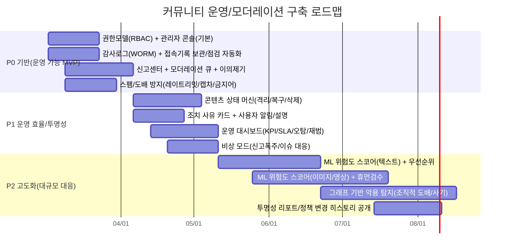

# 한국 커뮤니티 플랫폼의 유저·글 관리 및 관리자 권한 비교와 차세대 커뮤니티 설계 권고안

## Executive Summary

국내 커뮤니티 플랫폼의 **유저·글 관리 방식은 “누가(주체) 무엇을(권한) 어떤 근거로(정책) 얼마나 투명하게(설명·로그·이의제기) 집행하느냐”의 조합**으로 갈립니다. 공개된 규정·공지·보도자료 기준으로 보면, (1) **서브커뮤니티 자치형**(예: 디시인사이드 마이너/미니)은 **매니저/부매니저**에게 차단·삭제·필터 같은 실무 권한을 폭넓게 위임하고(차단 대상/목록/해제, 삭제 목록 제공 등) 운영 부담을 분산합니다. citeturn36view1turn36view0turn35view0 (2) **중앙집중+자동화형**(예: 에브리타임)은 ‘AI 모니터링+운영 인력’을 축으로 신고·유해성 판단을 자동화하고, 위반 시 즉시 조치(경고성 제한→누적 시 장기 제한)를 강조합니다. citeturn12search17turn12search1 (3) **규제 민감형(금융)**(예: 토스 종목토론방/토스증권 커뮤니티)은 투자·사기·불공정거래 리스크를 전제로 커뮤니티 이용규칙, 이의제기 절차, 특정 종목 커뮤니티 중단(요주의종목) 같은 위험관리 조항을 두고, ‘주주 표시’ 같은 신뢰 신호를 제품 기능으로 결합합니다. citeturn39search1turn39search9turn39search16

향후 유사 커뮤니티를 새로 개발할 때의 실무 권고는 다음 3가지로 요약됩니다.  
첫째, **권한 모델(RBAC+ABAC)과 워크플로(모더레이션 큐/티켓)를 ‘처음부터’ 설계**해야 합니다. 운영 규모가 커질수록 “누가 무엇을 했는지”를 재구성하는 비용(사고 대응·분쟁·감사)이 폭증하며, 개인정보처리시스템 접속기록 보관 같은 법·가이드 요구도 함께 커집니다. citeturn41search3  
둘째, **제재·삭제·숨김을 단일 액션이 아니라 ‘상태 머신(게시물 상태/유저 상태)’로 모델링**해서, 자동화·인력 검수가 공존하는 구조를 만들어야 합니다(예: “게시→임시 보류→검토→복구/삭제”). 불법정보 유통 금지(정보통신망법) 및 불법촬영물 유통방지 의무(전기통신사업법 하위 기준) 같은 규제는 “신고·삭제요청 기능”, “검색결과 제한”, “기술적 조치”를 요구합니다. citeturn41search5turn41search10turn41search4  
셋째, **투명성(사유 고지·이의제기·감사로그)과 운영 효율(자동화/ML)의 ‘동시 최적화’**가 커뮤니티 건강의 핵심입니다. 신고 처리 결과 안내를 검토한다는 운영사 인터뷰 사례처럼, “유저가 납득 가능한 설명”은 장기적으로 신고 품질과 운영 부하를 함께 개선합니다. citeturn12search17turn39search1

---

## 기존 서비스들이 지원하는 기능

아래 비교는 “공식 공지/규정/약관/신뢰 가능한 보도”에서 **명시적으로 확인 가능한 범위**에 한정합니다. (일부 서비스는 웹 페이지가 동적 렌더링이어서 원문 열람이 제한되어, 보도·인터뷰 인용 비중이 상대적으로 커졌습니다.) citeturn12search17turn12search1turn36view1turn36view0turn29view0turn39search1turn39search9

### 서비스별 관리자 권한(유저 제재·권한 레벨·모더레이션) 비교

| 구분 | 디시인사이드(마이너/미니 중심) | 아카라이브 | 에브리타임 | 토스 종목토론방(토스증권 커뮤니티) |
|---|---|---|---|---|
| 권한 레벨(역할) | 매니저/부매니저 정의 및 운영원칙(권한·책임·제한) 명시 citeturn35view0 | 공지사항 UI에 운영 섹션(공지/문의/채널문의) 노출, 별도 Inquiry/Channel inquiry board 존재 citeturn29view0 | 중앙 운영(운영 인력+AI 모니터링) 중심으로 설명 citeturn12search17turn12search1 | 이용규칙 위반 시 “이용 제한”, 이의제기로 재검토 가능(규칙에 위배되지 않으면 해제 가능) citeturn39search1 |
| 유저 제재(차단/정지/경고) | 게시물 하단 ‘차단’으로 작성자 차단(회원은 ID, 비회원은 IP), 차단 목록/해제 가능 citeturn36view1 | (공개 확인) 신고 기능 업데이트·신고 사유 카테고리 관련 공지 존재 → 신고 기반 제재 체계가 있음을 시사 citeturn29view0 | “경고 의미의 3일 이용 제한” → 누적 시 “최대 5년”까지 이용 제한 가능(운영사 인터뷰) citeturn12search17 | 이용규칙·약관 기반 이용 제한, 이의제기 절차 명시 citeturn39search1turn39search9 |
| 차단 기간/단계 | 차단 기간 옵션에 7일 항목 추가(관리 기능 개편 공지) citeturn36view0 | (공개 문서 부족) | 단계형 제재(단기→장기)와 누적 기반 강화 언급 citeturn12search17turn12search1 | (공개 문서 부족) 단, “이용 제한” 및 재검토 절차는 명시 citeturn39search1 |
| 신고 처리(분류/접수) | 본 자료 범위에서 ‘신고 분류/처리’ 상세는 공식문서로 직접 확인된 근거 부족(단, 서비스 전반 신고 UI는 존재) | 신고 기능 업데이트 안내/신고 사유 카테고리 관련 공지 목록 존재 citeturn29view0 | 신고 누적 시 자동 삭제 등 AI 기반 처리 체계 언급 citeturn12search1turn12search17 | 이용규칙 페이지에서 신고·제한·이의제기 흐름을 안내(스니펫 기준) citeturn39search1turn39search2 |
| 모더레이션 워크플로(큐/검수) | 매니저가 삭제·차단 등 실행(단, 운영원칙상 “정상 활동 제한 목적의 남용” 금지) citeturn35view0turn36view1 | Inquiry/Channel inquiry board 분리 노출 → “문의/소명” 채널이 제품 구조로 존재 citeturn29view0 | AI 모니터링 + 운영 인력이 영업일 3일 내 처리 노력(문의/불편 접수) citeturn12search17 | 약관·이용규칙 위반 시 제한 및 이의제기 재검토 절차 명시 citeturn39search1turn39search9 |
| 자동화/필터링 | 특정 IP 대역에만 도배 방지 코드(캡차) 적용 기능, 차단 시 동시 삭제 등 운영 자동화 옵션 citeturn36view0 | (공개 확인) DDOS/크롤링 대응 공지 및 기능 고지(공지 목록) 수준에서 확인 citeturn29view0 | 실시간 AI 모니터링, 이미지/영상은 ML(AWS AI 기술)로 검토(인터뷰) citeturn12search17 | 금융 사기/불법 투자 권유를 전제로 한 운영정책(채팅/주제별 채팅)에서 불법 투자자문·현혹 표현 금지 등 명시 citeturn39search15turn39search7 |
| 로그·감사(관리 내역) | “삭제 목록” 제공(매니저/부매니저가 삭제한 게시물 목록 확인) citeturn36view0 | (공개 문서 부족) | 개인정보 처리방침에서 로그(IP, 접속시간) 자동 수집 및 신고센터 관련 보관 등 언급(아카이브 캡처) citeturn11search1 | (공개 문서 부족) |
| 통계/대시보드 | (공개 문서 부족) | (공개 문서 부족) | 운영 목적 중 “통계 자료 도출”을 개인정보 처리 목적에 포함(아카이브 캡처) citeturn11search1 | 종목토론방 내 ‘핫글 랭킹’, ‘종목 소식’ 등 정보/랭킹 기능 추가 공지(토스증권 서비스 내 뉴스) citeturn39search27 |
| 외부 권리/불법정보 대응 | 운영원칙에서 불법·저작권·개인정보 침해 등 금지 및 제재 유형(노출 제한/이용정지/매니저 해임/접근 제한/폐쇄) 명시 citeturn35view0 | (공개 확인 제한) | AI로 유해행위 감지·조치, 이미지/영상 포함 콘텐츠 ML 검토(인터뷰) citeturn12search17 | 커뮤니티 이용규칙에서 불건전 게시물 피해 주의 및 신고 등 안내(스니펫) citeturn39search2 |

### 서비스별 글 관리(삭제·수정·고정·숨김·검색 등) 비교

| 구분 | 디시인사이드(마이너/미니 중심) | 아카라이브 | 에브리타임 | 토스 종목토론방(토스증권 커뮤니티) |
|---|---|---|---|---|
| 삭제(관리자) | 매니저/부매니저 삭제 내역을 “삭제 목록”으로 확인 가능 → 관리자 삭제 기능 전제 citeturn36view0 | 공지/채널 UI 상 ‘Notice(공지)’ 체계 존재(채널 단에서 공지글 운영) citeturn29view0 | 신고·AI 판단으로 위반 콘텐츠 “즉시 조치/삭제” 언급 citeturn12search17turn12search1 | 이용규칙 위반 시 제한/조치(스니펫), 세부 “삭제/숨김” 액션은 공개 문서로 직접 확인 제한 citeturn39search1turn39search2 |
| 숨김/노출 제한 | 운영원칙상 위반 게시물은 “노출 제한” 가능(게시물 제한) citeturn35view0 | (공개 문서 부족) | AI 시스템이 게시물 삭제 외 제재 수행, 일부는 자동 처리(보도) citeturn12search1turn12search17 | (공개 문서 부족) |
| 고정/공지 | (공개 문서 부족) | Notice(공지) 채널 및 채널 내 공지 목록 구조가 UI로 확인 citeturn29view0 | (공개 문서 부족) | (공개 문서 부족) |
| 글 이동(카테고리 이동) | (공개 문서 부족) | (공개 문서 부족) | (공개 문서 부족) | (공개 문서 부족) |
| 익명 처리(작성자 노출 방식) | 비회원 IP 기반, 회원 ID 기반 차단 구조로 볼 때 “완전 익명”이라기보다 계정/비회원 체계 혼재(차단 정책 기준) citeturn36view1 | (공개 문서 부족) | 익명 커뮤니티 성격 및 “완벽한 익명 시스템” 묘사(보도) citeturn13search6turn9search22 | “주주 표시”처럼 보유 여부 기반 신뢰 신호 제공(익명성 완화 방향의 기능) citeturn39search16turn39search22 |
| 편집 이력 | (공개 문서 부족) | (공개 문서 부족) | (공개 문서 부족) | (공개 문서 부족) |
| 태그/카테고리 | (공개 문서 부족) | 신고 사유 카테고리 관련 공지 목록 존재(운영 분류 체계 존재 시사) citeturn29view0 | 이용규칙 위반 카테고리를 AI로 감지·조치(폭력/괴롭힘/음란 등) 언급 citeturn12search17 | (공개 문서 부족) |
| 검색·필터 | (공개 문서 부족) | (공개 문서 부족) | (공개 문서 부족) | (공개 문서 부족) |
| 스팸·중복 탐지 | 도배 방지 코드(캡차) 및 IP 대역별 적용 등 스팸 대응 기능 강화 citeturn36view0 | DDOS/크롤링 대응 안내 공지(목록에서 확인) citeturn29view0 | AI 모니터링 기반 선제 대응(운영사 설명) citeturn12search17turn11search1 | 불법 투자 권유/현혹 표현 등 금지(운영정책), 사기 예방 안내(자체 콘텐츠) citeturn39search15turn39search7 |

### 커뮤니티 개발 관점에서의 기능 우선순위·중요도

아래는 **“유사 커뮤니티를 새로 만든다면 반드시/가능하면/나중에”**로 나눈 실무 우선순위입니다. (근거는 위 서비스들의 운영 패턴과 국내 규제 요구의 결합입니다.) citeturn35view0turn12search17turn39search1turn41search10turn41search3

| 기능군 | 중요도 | 이유(실무/리스크) | 핵심 KPI 예시 |
|---|---|---|---|
| 신고→검토→조치 워크플로(티켓/큐) + 이의제기 | 매우 높음 | 신고가 누적되면 자동 삭제·제재가 발생하는 구조는 오탐/억울함 이슈가 쉽게 커져 반발·이탈로 이어짐. 이의제기·재검토는 분쟁 비용을 줄이는 안전장치 citeturn12search1turn39search1 | 처리 리드타임(P50/P95), 이의제기 인용률, 재위반률(Recidivism) |
| 제재 상태 모델(경고/단기 제한/장기 제한/영구) | 매우 높음 | 단계형 제재는 “초기 경고→행동 교정”에 유리. 단일 영구정지 vs 단계형의 운영 유연성 차이가 큼 citeturn12search17turn36view0 | 제재 후 7/30일 재위반률, 사용자 복귀율 |
| 역할 기반 권한(RBAC) + 남용 방지(승인/로그) | 매우 높음 | 커뮤니티 자치형에서는 매니저 권한 남용 위험이 상존. “삭제/차단” 같은 고위험 액션은 감사 가능해야 함 citeturn35view0turn36view0 | 관리자 액션 분포, 남용 신고 건수, 감사 로그 커버리지 |
| 감사 로그·접속 기록·보관/점검 | 매우 높음 | 개인정보처리시스템 접속기록은 1년 이상 보관·관리 등 기준이 존재. 사고 대응/내부통제에 필수 citeturn41search3 | 로그 보관 준수율, 다운로드 이벤트 점검률 |
| 스팸/도배 방지(레이트리밋/캡차/필터) | 높음 | 초기 커뮤니티는 스팸·도배가 성장 저해의 1순위. IP 대역별 캡차 같은 실무적 기능이 효과적 citeturn36view0 | 스팸 신고율, 자동 차단 적중률, 신규 유저 이탈률 |
| 불법정보·권리침해 대응 기능 | 높음 | 불법정보 유통 금지 및 불법촬영물 유통방지 기술·관리적 조치(신고·삭제요청 기능 포함) 요구가 존재 citeturn41search5turn41search10turn41search4 | 권리침해 처리 리드타임, 재업로드 차단율 |
| 랭킹/추천(핫글) + 신뢰 신호(주주 표시 등) | 중간~높음 | 금융·정보형 커뮤니티는 허위 정보·선동 리스크가 있어 신뢰 신호/랭킹 투명성이 중요 citeturn39search16turn39search27 | 허위정보 신고율, 랭킹 조작 탐지율 |
| ML 기반 자동 분류/위험도 스코어 | 중간 | 운영 효율은 크게 올리지만, 오탐/편향 관리·설명가능성이 필요. “휴먼 인 더 루프” 전제가 안전 citeturn12search17turn41search29 | 오탐률(Overturn), 모델 드리프트 지표 |

주요 출처(한국어 우선): 디시인사이드 공지(이용자 차단/관리 기능) citeturn36view1turn36view0, 디시인사이드 운영원칙 citeturn35view0, 에브리타임 운영 인터뷰/보도 citeturn12search17turn12search1, 토스증권 커뮤니티 이용규칙·약관/관련 공지 citeturn39search1turn39search9turn39search5, 국가법령정보센터(정보통신망법/전기통신사업법/개인정보 안전조치 기준) citeturn41search5turn41search10turn41search3

---

## 개선되면 좋을 기능

현행 플랫폼들의 공통 병목은 (a) **제재의 일관성/설명가능성**, (b) **운영 효율(대량 신고·도배·악성 반복) 대응**, (c) **법/규제 대응(불법정보·불법촬영물·개인정보)**, (d) **신뢰·투명성(커뮤니티 건강)**입니다. 특히 불법촬영물 등 유통방지 조치는 “신고·삭제요청 기능 마련”과 같은 구체 요건이 하위 규정에 제시되어 있어, 규모가 커질수록(특히 10만 DAU급) 사전조치 체계가 중요해집니다. citeturn41search10turn41search4turn41search23

### 개선 기능 목록과 기대효과

| 개선 기능 | 사용자 경험(UX) 기대효과 | 보안·프라이버시 | 운영 효율성 | 확장성 | 커뮤니티 건강(신뢰·투명성) |
|---|---|---|---|---|---|
| “조치 사유 카드” + 규칙 링크 + 증거 스냅샷(정책 기반) | 억울함/혼란 감소, 이의제기 품질 향상 | 과도한 개인정보 노출 없이 최소 증거만 제시(마스킹) | 문의/클레임 감소 | 규칙·카테고리 확장 용이 | “왜 삭제/제재됐는지” 가시화로 납득성 상승 citeturn39search1turn12search17 |
| 통합 신고센터(신고/권리침해/불법촬영물/사기) + SLA | 신고 경로 단순화, 처리 예측 가능 | 불법촬영물 등 신고·삭제요청 기능 요건과 정합 citeturn41search10turn41search4 | 큐 기반 처리로 운영자 효율 | 큐·라우팅 분산 가능 | 처리 결과 통지로 신고 신뢰도 상승 |
| 제재 상태 머신(경고→단기→장기→영구) + 자동 해제 | “처벌”이 아니라 “교정” 중심 | 반복 악용 계정은 단계 상승 | 재범 억제, 재발 비용 감소 | 정책 변경 시 룰만 수정 | 일관된 제재 기준이 공정성 인식 개선 citeturn12search17turn36view0 |
| 커뮤니티 단위 권한 위임 + 남용 방지(2인 승인/쿼럼/감사) | 로컬 룰 반영(문화/주제별) | 권한 남용 억제, 책임 추적 | 중앙 운영 부담 분산 | 채널 수 증가에도 운영 가능 | 자치 + 감사 로그로 신뢰 확보 citeturn35view0turn36view0 |
| 소프트 삭제(Quarantine) + 재검토 + 복구 버튼 | 오탐 시 빠른 복구 | 법적 보존/증거 관리와 분리 | 운영자 재작업 감소 | 상태 기반으로 대량 처리 | “투명한 복구”가 신뢰 유지 |
| 자동 스팸/도배 방지(레이트리밋·캡차·금지어·링크 정책) | 이용 환경 개선 | 악성 자동화/크롤링 완화 | 신고량 감소 | 트래픽 증가에 선형 대응 가능 | 초반 커뮤니티 붕괴 방지 citeturn36view0 |
| ML 위험도 스코어 + 휴먼 인 더 루프(mod queue 우선순위) | 정상 이용자 피해 최소화 | 고위험 콘텐츠만 샘플링해 프라이버시 영향 최소화(필요 최소 범위) | 처리 속도↑ | 대규모에서 필수 | 오탐률을 “이의제기 인용률”로 지속 보정 citeturn12search17turn41search29 |
| 신뢰 신호(검증/배지) + 금융/정보 커뮤니티용 가드레일 | 정보 신뢰도 상승 | 사칭·불법 투자 권유 억제 | 분쟁 감소 | 도메인별 룰 적용 | “누가 말하는가”의 맥락 제공 citeturn39search16turn39search15turn39search7 |
| 운영 대시보드(신고/제재/오탐/재범/처리시간) + 투명성 리포트 | 사용자에게도 요약 제공 가능 | 로그·리포트 체계화 | 운영 병목 가시화 | 데이터 파이프라인 확장 | 운영 신뢰(투명성) 구축 citeturn41search23turn41search3 |

### 개선 기능 우선순위 표

아래는 “소규모(수천 MAU)~대규모(수백만 MAU)”를 모두 고려해, **초기 ROI와 리스크를 함께 반영**한 우선순위입니다. (P0=4~8주 내 필수, P1=3~4개월 내, P2=6개월+) citeturn41search10turn41search3turn12search17turn36view0

| 우선순위 | 기능 묶음 | 이유 | 성공 기준(정량) |
|---|---|---|---|
| P0 | 권한 모델(RBAC) + 감사 로그 + 기본 제재(경고/차단/삭제) | “운영 가능한 최소 단위(MVP)”이면서, 나중에 바꾸기 가장 비싼 기초 구조(권한/로그) citeturn41search3turn35view0 | 관리자 액션 100% 로깅, 신고 처리 P95 < 72h |
| P0 | 신고센터 + 모더레이션 큐 + 이의제기 | 신고 폭주·오탐 분쟁을 구조적으로 흡수. 이의제기 없는 자동제재는 반발 리스크 큼 citeturn39search1turn12search1 | 이의제기 처리 P95 < 7d, 인용률 트래킹 |
| P0 | 스팸/도배 방지(레이트리밋/캡차/링크 정책) | 초기 커뮤니티 생존 요소. 디시의 “IP대역 캡차”처럼 운영 측면에서 즉효 citeturn36view0 | 스팸 신고율 -50%, 신규 이탈률 -10% |
| P1 | 상태 머신(Quarantine/복구) + 조치 사유 카드 | 자동화 확대의 전제(오탐 대비). 설명가능성은 문의량을 줄임 citeturn12search17turn39search1 | 오탐(인용)률 < 5%, 문의량 -30% |
| P1 | 운영 대시보드 + 정책/룰 엔진 | 운영 병목을 데이터로 관리, 규칙 변경을 코드 배포 없이 가능 | MTTR(사고) 단축, 정책 배포 리드타임 < 1d |
| P2 | ML 위험도 스코어(텍스트/이미지) + 그래프 기반 악용 탐지 | 대규모에서 필수. 다만 데이터/라벨/편향 관리 비용이 큼 citeturn12search17turn41search29 | 처리 자동화율 60%+, 인용률 안정(드리프트 감지) |

---

## 어떻게 개선을 하지

### 기술적 설계(아키텍처 개요)

아래는 “모더레이션을 제품의 부속 기능이 아니라 **플랫폼 코어**”로 보는 아키텍처입니다. 핵심은 (1) **이벤트 기반 감사추적**, (2) **정책/룰의 구성 가능성**, (3) **휴먼 인 더 루프+자동화 결합**입니다. 개인정보처리시스템 접속기록 보관·점검 같은 요구가 존재하므로, 최소 1년 이상 보관되는 감사/접속 로그 레이어를 분리하는 접근이 실무적으로 안전합니다. citeturn41search3turn41search6

```mermaid
flowchart LR
  U[User Web/Mobile] --> API[API Gateway]
  MOD[Moderator Console] --> API

  API --> AUTH[Auth & Identity]
  API --> COM[Community Service]
  API --> CNT[Content Service]
  API --> REP[Report Service]

  CNT --> DB1[(Primary DB: Posts/Comments)]
  COM --> DB2[(Primary DB: Communities/Roles)]
  AUTH --> DB3[(Primary DB: Users/Consents)]

  %% Moderation pipeline
  REP --> Q[(Moderation Queue)]
  CNT --> EVT[(Event Bus)]
  REP --> EVT

  EVT --> RULE[Rule Engine\n(rate limit/keyword/link policy)]
  EVT --> MLS[ML Risk Scoring\n(text/image)]
  RULE --> DEC{Decision}
  MLS --> DEC

  DEC -->|allow| CNT
  DEC -->|quarantine| QUAR[Quarantine Store]
  DEC -->|action required| MODQ[Mod Review UI]

  MODQ --> ACT[Action Service\n(warn/ban/remove/restore)]
  ACT --> CNT
  ACT --> AUTH
  ACT --> AUD[(Immutable Audit Log/WORM)]

  %% Search & analytics
  CNT --> SRCH[Search Index]
  EVT --> MET[Metrics & BI]
  AUD --> MET

  %% Storage
  CNT --> OBJ[(Object Storage: images/files)]
```

### 개선 기능별 구현 방안(우선순위·난이도·데이터·워크플로·ML·법·윤리·운영)

아래 표는 “개선 기능”을 **개발 항목(Work Item)**으로 쪼개어, 실무적으로 바로 쓰기 가능한 수준의 설계를 제안합니다. (난이도는 소규모~대규모 모두를 고려한 상대 평가)

| 개선 기능(설계 단위) | 우선순위 | 난이도 | 필요한 데이터·지표 | 권한 모델·워크플로(핵심) | 자동화/ML 적용 | 법적·윤리적 고려 | 운영 가이드(SOP) 요약 |
|---|---|---|---|---|---|---|---|
| RBAC + ABAC(컨텍스트 권한) + 위임(Delegation) | P0 | 중간 | Role 변경 이벤트, 권한 사용 로그 | **역할(Owner/Mod/Helper) + 조건(채널, 기간, 액션 타입)**. 위험 액션(영구정지/대량삭제)은 2인 승인(쿼럼) | (초기엔 룰 기반) | 권한 남용은 커뮤니티 신뢰를 직접 훼손. “정상 활동 제한 목적 남용 금지” 같은 운영원칙을 제품에 내장(권한 제한/감사) citeturn35view0turn36view0 | ① 신규 모더레이터 온보딩(권한 범위 교육) ② 금지 행위 사례집 ③ ‘영구 조치’ 체크리스트(증거/근거/승인) |
| 감사 로그(모더레이터 액션) + 개인정보처리시스템 접속기록 | P0 | 중간 | 액션 로그(누가/언제/무엇을/이유코드), 접속기록 보관율 | 모든 조치는 Action Service를 통해서만 실행(직접 DB 수정 금지). 로그는 WORM 저장(변조 방지) | (필요시) 이상 탐지(특정 모더레이터 과다 삭제 등) | 접속기록 1년 이상 보관 요구가 명시된 기준 존재 citeturn41search3turn41search6 | 월 1회 로그 점검(다운로드 이벤트/대량 삭제), 내부 감사 리포트 |
| 통합 신고센터 + “신고 사유 체계” + 우선순위 큐 | P0 | 낮음~중간 | 신고 사유, 신고자 신뢰도, 처리시간(SLA), 인용률 | 신고→티켓 생성→자동 분류(룰/ML)→검토 큐 라우팅. ‘채널 내 소명’ 별도 트랙(아카라이브의 channel inquiry board 같은 분리 구조 참고) citeturn29view0 | 초기: 룰 기반 라우팅. 이후: 위험도 점수 | 불법촬영물 등 유통방지 조치에서 “상시 신고·삭제요청 기능” 등 요건이 제시됨 citeturn41search10turn41search4 | 신고 처리 템플릿(사유/근거/조치), 반복 신고자(악성 리포터) 대응 규정 |
| 제재 상태 머신(경고→단기→장기→영구) + 자동 해제 | P0 | 중간 | 제재 단계, 누적 위반, 재위반률, 이의제기 인용률 | “경고(UX 팝업)→작성 제한→채널 제한→서비스 제한”을 분리. 단계상승 기준을 정책으로 관리(에브리타임의 3일→최대 5년 구조가 ‘단계형’의 한 예) citeturn12search17 | 룰 엔진(누적/기간) | 과잉 제재 위험: 이의제기 채널과 함께 설계(토스증권 규칙의 재검토 절차 참고) citeturn39search1 | ‘초범 경고’ 문구 표준화, 재범자 처리 기준, 학교/직장 등 민감 커뮤니티는 추가 보호장치 |
| 콘텐츠 상태 모델(게시/보류/격리/삭제/복구) + 소프트 삭제 | P1 | 중간 | 상태 전이 로그, 복구율, 오탐률 | 자동탐지는 “격리(Quarantine)”로 두고, 최종 삭제는 검토 후. 디시의 ‘노출 제한’ 개념처럼 단계화 citeturn35view0 | ML 고위험만 격리 | 불법정보는 신속한 접근 제한 필요(정보통신망법의 불법정보 유통 금지 조항과 실무상 시정요구·삭제 흐름 고려) citeturn41search5turn41search2 | 격리 큐 SLA(예: 24h), 복구 시 사유 통지 |
| 스팸/도배 방지: 레이트리밋·캡차·링크 정책·금지어 | P0 | 낮음 | 게시/댓글 속도, 링크 비율, 신규계정 행위, 스팸 신고율 | ‘쓰기’ API 레벨에서 토큰버킷/슬라이딩 윈도우. 특정 IP대역 캡차(운영자 설정)처럼 “정밀 타깃팅” 옵션 제공 citeturn36view0 | (선택) 봇 탐지 모델 | 과도한 캡차는 UX 저해. 특정 조건(급증, 신규, VPN 의심)에서만 트리거 | 운영자에게 “방어 룰 프리셋” 제공(평시/비상시), 스팸 캠페인 대응 플레이북 |
| ML 위험도 스코어(텍스트/이미지) + 휴먼 인 더 루프 | P2 | 높음 | 라벨 데이터(신고 결과/운영자 판정), Precision/Recall, Drift | 모델은 “자동 삭제”가 아니라 “우선순위/격리 추천”부터 시작. 에브리타임이 이미지·영상에 ML(AWS) 활용 언급 citeturn12search17 | 텍스트: 혐오/괴롭힘/스팸/사기 패턴. 이미지: 불법촬영물/음란/폭력 추정 | 정부 브리핑에서는 불법촬영물 조치가 “디지털특징정보 추출 후 비교” 등 방식이며 사적대화방 제외 등 취지를 설명 citeturn41search29 | 모델 품질 리뷰(주간), 오탐/편향 점검, “이의제기 인용률”을 핵심 품질지표로 관리 |
| 신뢰 신호(검증 배지/주주 표시/전문성 표시) + 금융 커뮤니티 가드레일 | P1~P2 | 중간 | 검증 이벤트(보유/자산 구간 등), 사기 신고율 | 토스증권 사례처럼 ‘주주 표시’로 발화의 맥락 제공 citeturn39search16turn39search22. 동시에 토스 운영정책처럼 불법 투자 권유/현혹 표현 금지 룰을 제품에 내장 citeturn39search15turn39search7 | 룰 기반(금지 키워드/링크/유사투자자문 패턴), 이후 ML | 금융은 특히 유사투자자문/사칭 문제에 민감. “신고·차단·기관 신고” 안내 콘텐츠를 함께 제공(토스 자체 안내 참고) citeturn39search7 | 금융 커뮤니티 전용 SOP(리딩방/사칭 대응), 고위험 키워드 사전/사후 리뷰 |
| 위험 종목/위기 상황 대응(토론방 일시 중단/모드 전환) | P1 | 중간 | 종목 이벤트(거래정지/관리종목 등), 신고 폭주 | 약관 수준에서 “요주의종목 지정 후 커뮤니티 서비스 일부/전부 중단” 같은 위험관리 조항이 존재 citeturn39search9turn39search18. 유사 기능을 “Incident Mode”로 일반화: 쓰기 제한/링크 제한/모더레이션 강화 | 룰 기반 트리거(지표 급등/신고폭주) | 표현의 자유 vs 시장 교란 방지의 균형. 최소 기간/사유 공개 원칙 권장 | ‘비상 모드’ 체크리스트, 해제 조건, 사후 리포트(투명성) |

### 소규모~대규모 시나리오별 구현 전략

- **소규모(수천 MAU)**: “모듈러 모놀리스 + 단일 DB + 큐(예: Redis/단순 메시지)”로도 충분합니다. 단, **Action Service(조치 API)와 Audit Log는 초기에 분리**해 두어야, 이후 운영·감사 요구가 생겼을 때 이행 비용이 폭발하지 않습니다(접속기록 보관 기준 등). citeturn41search3  
- **중간(수십만 MAU)**: 모더레이션 큐·룰 엔진·검색 인덱스를 분리하고, 이벤트 버스로 “콘텐츠 이벤트/신고 이벤트/조치 이벤트”를 스트리밍 처리합니다. “핫글 랭킹” 같은 지표성 기능도 이 레이어에서 안전하게 계산할 수 있습니다. citeturn39search27  
- **대규모(수백만 MAU)**: (1) 멀티 리전/샤딩, (2) ML 서빙/피처스토어, (3) 투명성 리포트·대량 요청 처리(법 집행/권리침해)까지 포함한 운영 체계를 권장합니다. 불법촬영물 등 유통방지 책임자 지정·교육·투명성보고서 같은 제도 요구가 언급되는 만큼, 규모가 커지면 거버넌스 기능이 “옵션”이 아니라 “필수 운영비”가 됩니다. citeturn41search23turn41search10

### 마일스톤 타임라인(단계별 로드맵)

아래는 “기능을 쌓아 올릴 때, 운영 난이도가 폭증하지 않도록” **기초→운영화→자동화** 순으로 배치한 로드맵입니다. (기간은 팀 규모 미지정이므로 상대적 단계로 제시)



### 법적·윤리적 체크리스트(핵심만)

- **불법정보/유해정보**: 정보통신망을 통한 불법정보 유통 금지 조항(예: 음란·명예훼손 등)은 정책/룰 설계의 최소 기준이 됩니다. citeturn41search5  
- **불법촬영물 등 유통방지(사전조치)**: 대통령령 수준에서 “상시 신고·삭제요청 기능 마련”, “검색결과 제한” 같은 구체 조치가 제시됩니다. 커뮤니티가 커질수록 신고센터·검색·차단 체계를 처음부터 설계해야 합니다. citeturn41search10turn41search4  
- **프라이버시/로그**: 개인정보처리시스템 접속기록 보관·관리 기준이 명시되어 있어(최소 1년 보관 등), 관리자 콘솔·데이터 접근·다운로드 이벤트를 통제/기록하는 설계가 필요합니다. citeturn41search3turn41search6  
- **표현의 자유/과잉 검열 리스크**: 불법촬영물 기술 조치에 대해 정부는 “디지털특징정보 비교 방식”, “사적 대화방 미적용” 등 취지를 설명한 바 있어, 서비스 설계에서도 **최소침해(필요 최소 데이터·행위)** 원칙을 문서화하는 것이 바람직합니다. citeturn41search29  
- **금융 커뮤니티 특수성**: 불법 유사투자자문/사칭/현혹 표현은 운영정책으로 금지하고 신고·기관 안내를 제공하는 방식이 실무적으로 유효합니다. citeturn39search15turn39search7

이 보고서는 공개적으로 확인 가능한 문서·공지·보도에 기반한 비교이며, 각 서비스의 “앱 내부 관리자 도구(세부 UI/세부 권한)”는 공개 문서만으로는 모두 확정하기 어렵습니다. 그럼에도 위와 같은 **권한·워크플로·로그·투명성**의 코어 설계는 규모와 도메인을 가리지 않고(소규모~대규모) 재사용 가능하며, 국내 규제·분쟁 대응의 비용을 구조적으로 낮추는 방향입니다. citeturn41search3turn41search10turn12search17turn36view0